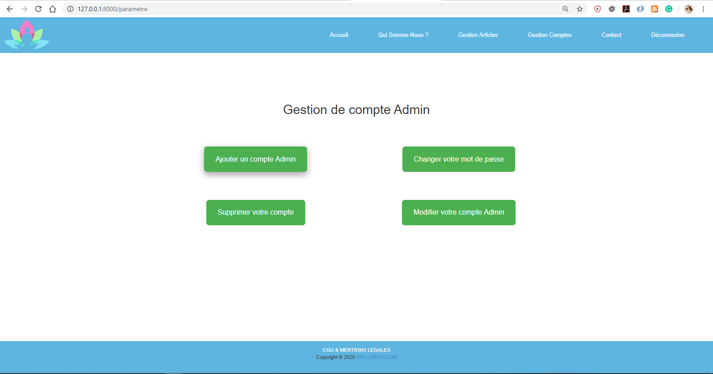
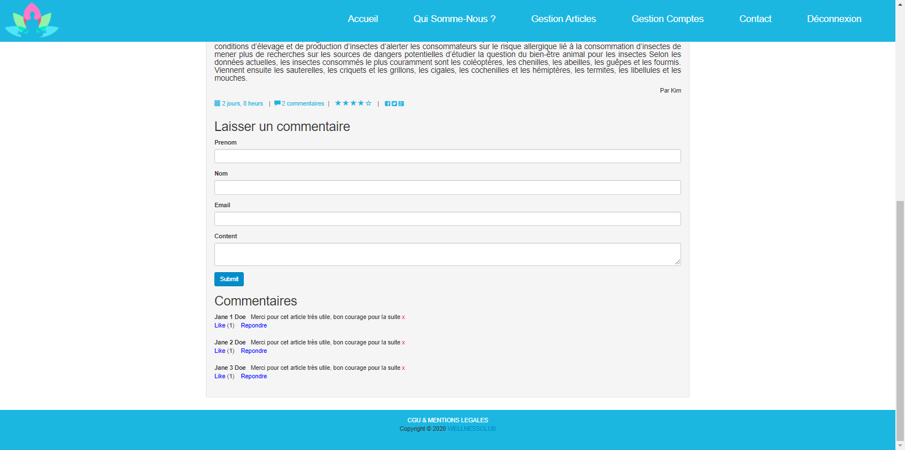
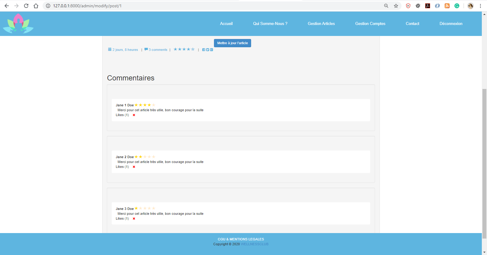
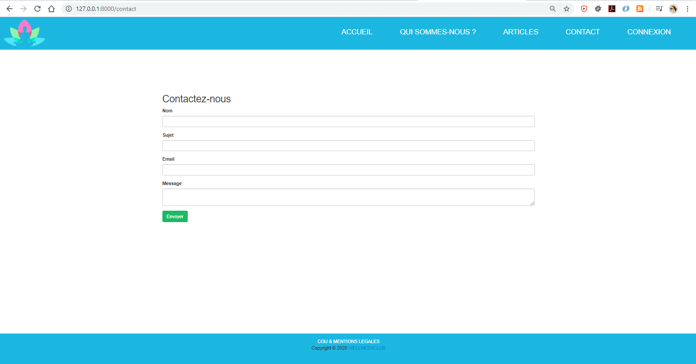

# I - Description
### Mission : 

Développement d'un blog de bien-être administré par les modérateurs de l'entreprise **Symfeed**.

Ce blog nommé __"WellnessClub"__ est implémenté en langage de programmation PHP avec le Framewok Symfony 5   
*ORM : Doctrine  
SGBD : MySQL 8.0.18  
Test : Fixtures*

__Ce projet contient les fonctionnalités suivantes__ :
-  Gestion du compte Admin (connexion, CRUD compte Admin, réinitialisation du mot de passe),
-  Gestion des articles (CRUD + affichage + Tests),
-  Gestion des commentaires et des avis (CRUD + affichage + Tests),
-  Gestion du système d'envoi de mail (avec le composant mailer de Symfony).  


__Le Blog comprend les services suivants:__
- Lire les articles du blog et les commentaires,
- Commenter un ou plusieurs articles,
- Répondre à un commentaire,
- Liker un commentaire,
- Noter un ou plusieurs commentaires de 0 à 5,
- Contacter l'administrateur via le formulaire de contact,
- Se connecter entant qu'Admin, et donc avoir en plus les privilèges suivants : 
  - Creer un compte Admin,
  - Reinitialiser son mot de passe,
  - Modifier les informations de son profil,
  - Supprimer son compte,
  - Ajouter un nouveau article avec image,
  - Modifier un article,
  - Supprimer un article, 
  - Supprimer un commentaire.


# II - Lancement

## 1. Prérequis
- Installer les dépendences du projet en utilisant la commande suivante :  
   `composer install`
    
- Créer la base de données MySQL en utilisant les commandes suivantes :
	```
      php bin/console doctrine:database:create
      php bin/console make:migration
      php bin/console doctrine:migrations:migrate --no-interaction
      php bin/console doctrine:fixtures:load --group=PostCommentFixtures --no-interaction

- Compiler assets et générer le dossier build en utilisant la commande suivante :  
     `yarn encore dev`
- Modifier le fichier .env selon votre configuration `(DATABASE_URL, MAILER_URL)`

## 2. Exécution du service
Le service se lance et tourne sur le port 8080 en utilisant la commande suivante : `php -S 127.0.0.1:8000 -t public`  
Pour se connecter en tant qu'administrateur du blog utiliser le mail et le mot de passe (d'initialisation) ci-dessous ;    
*Adresse mail : admin@wellnessClub.com   
Mot de passe :  password*  
 PS : une fois connecté, vous pouvez créer votre propre compte. 
## III - Captures
Accueil :


Qui somme-nous ? :


Gestion compte Admin :


Gestion des articles :


Gestion des commentaires :


Avis :


Contact :
 
