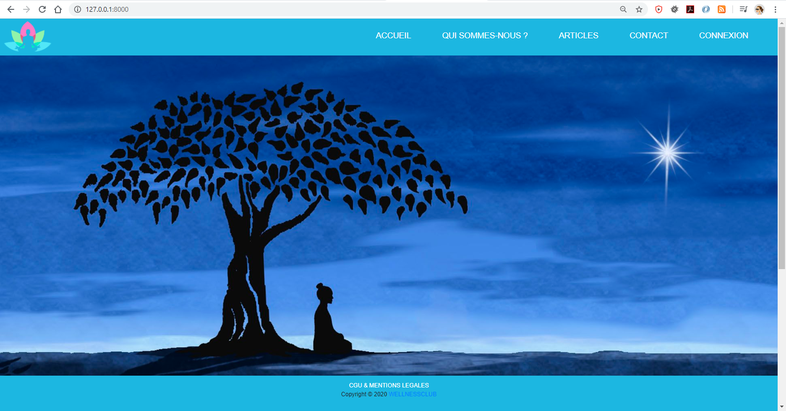
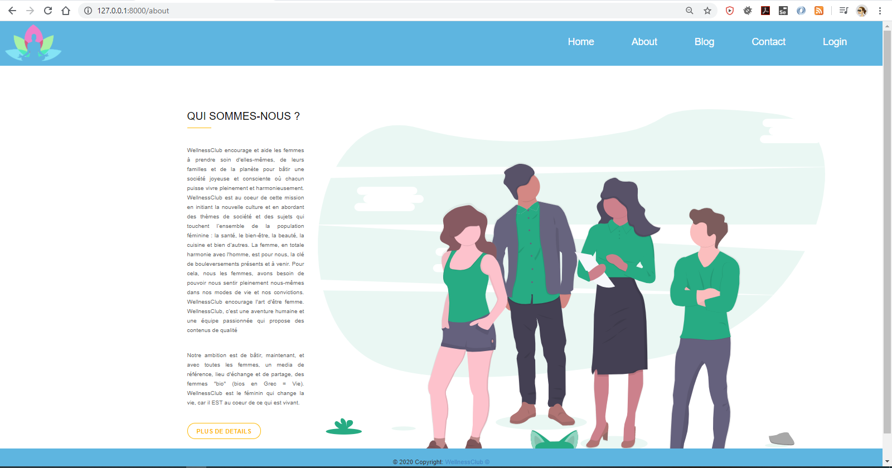
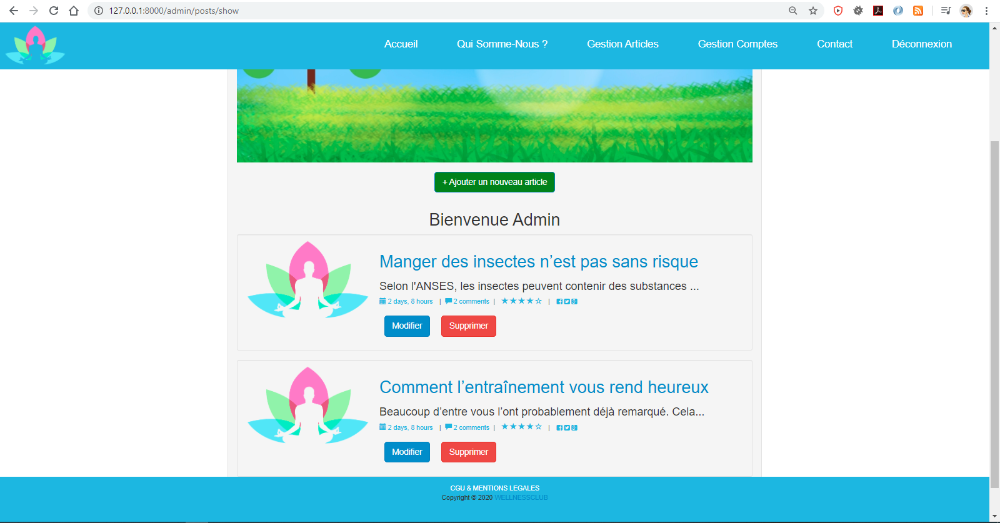

# I - Description
### Mission : 

Développement d'un blog de bien-être administré par les modérateurs de l'entreprise **Symfeed**.

*Ce blog nommé __"WellnessClub"__ est implémenté en langage de programmation PHP avec le Framewok Symfony 5   
ORM : Doctrine  
SGBD : MySQL 8.0.18  
Test : Fixtures*

__Ce projet contient 4 fonctionnalités__ :
-  gestion des articles (CRUD + affichage + Tests),
-  gestion des commentaires (CRUD + affichage + Tests),
-  gestion du système d'envoi de mail (avec le composant mailer de Symfony),  
-  gestion du compte Admin (connexion, création compte Admin, réinitialisation du mot de passe).  


__Le Blog comprend les services suivants:__
- Lire les articles du blog
- Commenter un ou plusieurs articles,
- Répondre à un commentaire,
- Supprimer son commentaire,
- Contacter l'administrateur via le formulaire de contact,
- Se connecter entant qu'Admin, et donc avoir en plus les privilèges suivants : 
  - Ajouter un nouveau article,
  - Modifier un article,
  - Supprimer un article.


# II - Lancement

## 1. Prérequis
- Installer les dépendences du projet en utilisant la commande suivante :  
   `composer install`
    
- Créer la base de données MySQL en utilisant les commandes suivantes :
	```php- php bin/console doctrine:database:create
	 php bin/console doctrine:schema:create
	 php bin/console doctrine:schema:update --force
	 php bin/console doctrine:fixtures:load --group=PostCommentFixtures --no-interaction```

- Compiler assets et générer le dossier build en utilisant la commande suivante :  
     `yarn encore dev`


## 2. Exécution du service
Le service se lance et tourne sur le port 8080 en utilisant la commande suivante : `php -S 127.0.0.1:8000 -t public`  
Pour se connecter en tant qu'administrateur du blog utiliser l'@mail et le mot de passe par défaut, ci-dessous ; (une fois connecté, vous pouvez changer les données de votre compte)  
Adresse mail : admin@wellnessClub.com 
Mot de passe :  password

## III - Captures
Liste des services :
- 

Liste des services visiteur :
- 

Test services admin:
- 

